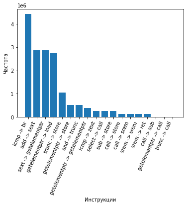

# Pass

Collect a trace of executed instructions of my graphical application on optimization –O2 (without phi processing).

### Program run

```
clang++ Pass.cpp -fPIC -shared -I$(llvm-config-18 --includedir) -o libPass.so
clang -fpass-plugin=./libPass.so Logger.cpp GameOfLife/app.c GameOfLife/sim.c GameOfLife/start.c
./a.out > Pass.txt
```

### Plot the frequency of instruction pairs

```
python3 PassGraph.py
```

## Statistics of my graphics application

